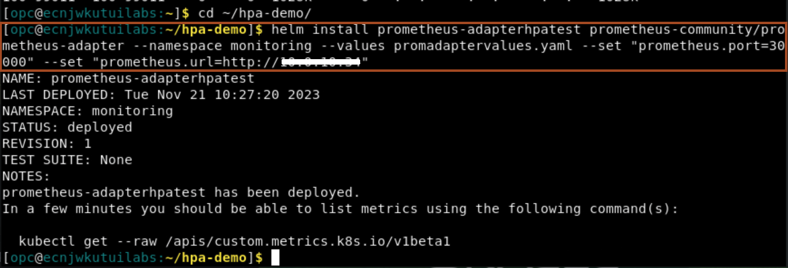
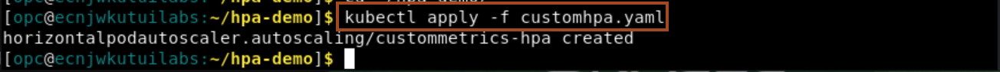

# Setup Prometheus Adaptor and HPA

## Introduction

In this lab, we will demonstrate how to scale a WebLogic cluster, based on WebLogic metrics provided by the Monitoring Exporter, using the Kubernetes Horizontal Pod Autoscaler (HPA). We will use the Prometheus Adapter to gather the names of the available metrics from Prometheus at regular intervals. A custom configuration of the adapter will expose only metrics that follow specific formats.

Estimated Time: 20 minutes

### Objectives

In this lab, you will:

* Install Prometheus Adaptor
* Install Kubernetes Horizontal Pods Autoscaler
* Simulate Auto scaling up and down

### Prerequisites

* Access to noVNC Remote Desktop created in lab 1.

## Task 1: Install Prometheus Adaptor

1. Copy and paste the following command in the terminal to navigate to workshop source code folder.
    ```bash
    <copy>cd ~/hpa-demo/</copy>
    ```

2. Copy and paste the following command in terminal and replace **`PRIVATE_IP_OF_WORKERNODE`** with private ip of worker and then run the command to install the prometheus adaptor.
    ```bash
    <copy>helm install prometheus-adapterhpatest prometheus-community/prometheus-adapter --namespace monitoring --values promadaptervalues.yaml --set "prometheus.port=30000" --set "prometheus.url=http://PRIVATE_IP_OF_WORKERNODE"</copy>
    ```
    

## Task 2: Install Kubernetes Horizontal Pods Autoscaler

1. Copy and paste the following command to the terminal to deploy the Kubernetes Horizontal Pod Autoscaler
    ```bash
    <copy>cd ~/hpa-demo/
    kubectl apply -f customhpa.yaml</copy>
    ```

    


## Task 3: Simulate Auto scaling up and down

1. In the terminal, copy and paste the following command to view running server pods in weblogic domain.  
    ```bash
    <copy>kubectl get pods -n test-domain-ns -w</copy>
    ```

    > you can title this tab as **Server Pods**.

2. Open a new tab in the terminal and copy and paste the following command in the new tab to view hpa running status.
    ```bash
    <copy>kubectl get hpa -n test-domain-ns -w</copy>
    ```

    > you can title this tab as **HPA Pod**.

3. In the Firefox, copy and paste the prometheus URL **http://`PUBLIC_IP_OF_WORKERNODE`:30000** and replace PUBLIC_IP_OF_WORKERNODE with public IP of worker node.


Congratulation !!!

This is the end of the workshop.

We hope you have found this workshop useful.

## Acknowledgements
* **Author** -  Ankit Pandey
* **Contributors** - Maciej Gruszka, Sid Joshi
* **Last Updated By/Date** - Ankit Pandey, November 2023